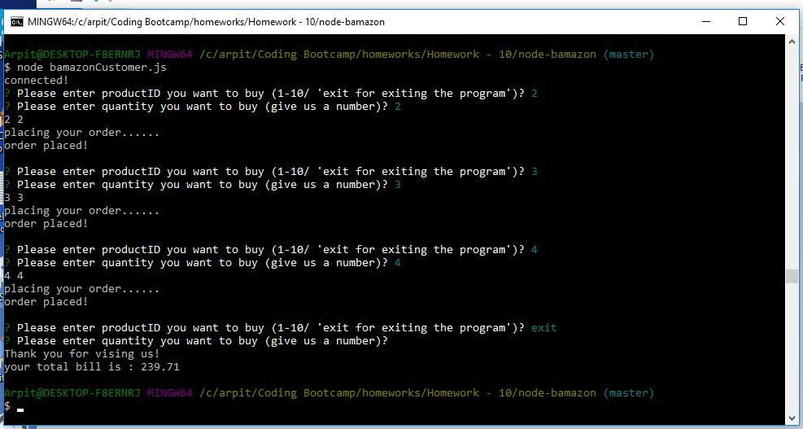
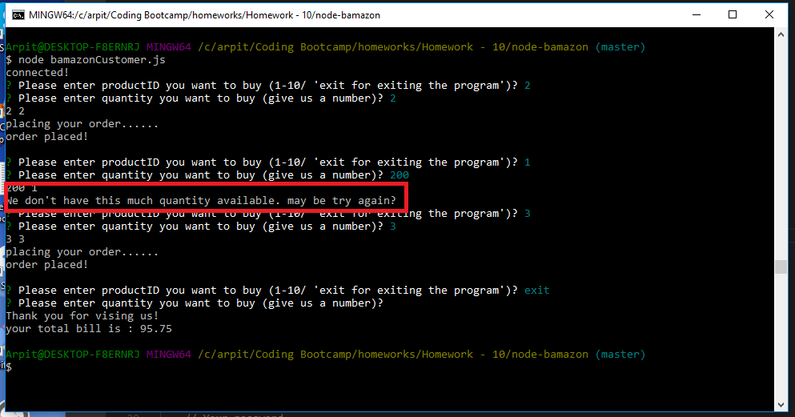
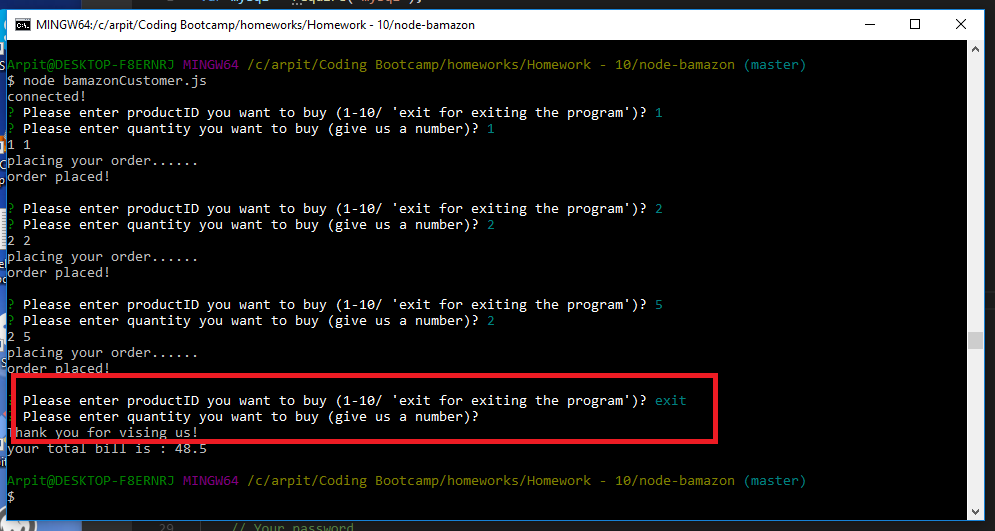

# node-bamazon
a node app to fetch data from mysql database and display using prompt

When you run this app, it keeps asking you for order until you type 'exit'. For each item_id, you need to provide quantity you are trying to buy. When you type 'exit', the app will exit loop and display total price. Total price is calculated by total items ordered by you and respective price of the item. Please refer to the screenshots provided to get idea about how this app works.

